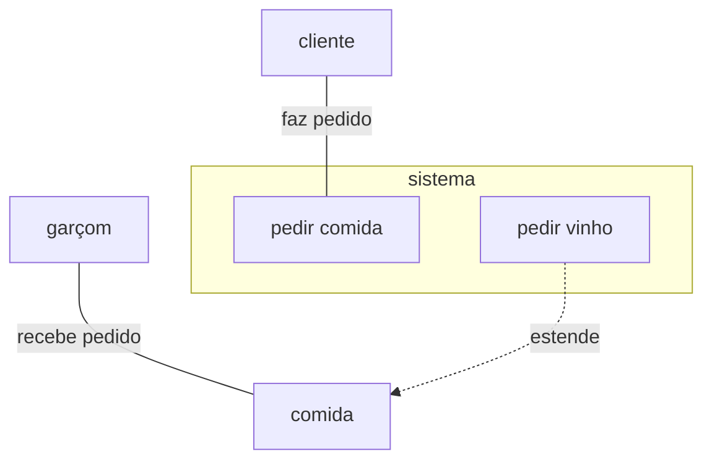
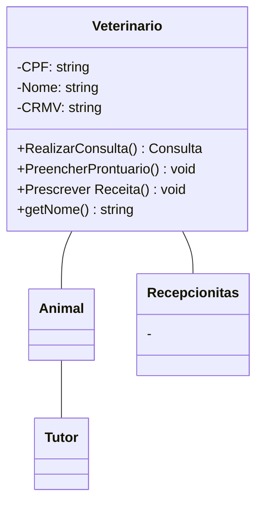

# trabalho-engenharia-software-2026
Trabalho de clínica veterinária do Técnico em Informática, segundo semestre de 2026.

--(25/09/2026)--

Protótipo Figma [LINK]: https://www.figma.com/design/uxk9P2VwbDa964dw4CMAKu/Sem-t%C3%ADtulo?node-id=3-682&t=1IR1WQj4OqZvaSx7-1

## Diagramas UML

### Diagrama Casos de Uso

### Diagrama de Classe

