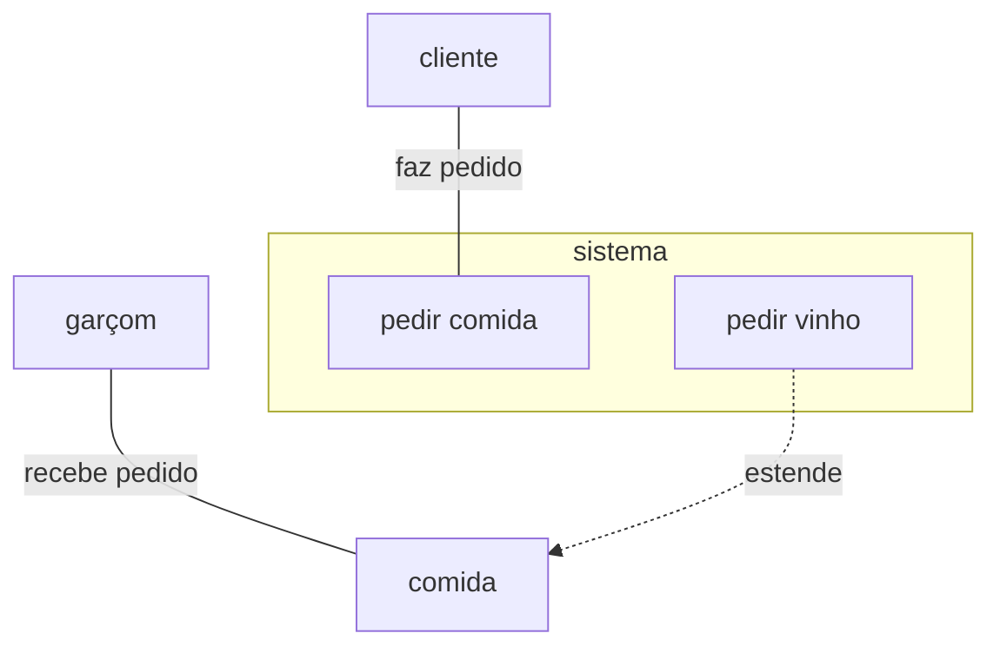

# trabalho-engenharia-software-2026
Trabalho de clínica veterinária do Técnico em Informática, segundo semestre de 2026.

Protótipo Figma [LINK]: 

## Diagrama UML

```mermaid
flowchart TD
    %% atores
      cliente["cliente"]
      garçom["garçom"]

    %%ações
    subgraph sistema  
       pedir["pedir comida"]
       vinho["pedir vinho"]
    end

    %% relacionamentos
    cliente -- "faz pedido" --- pedir
    garçom -- "recebe pedido" --- comida

    vinho -. "estende" .-> comida
```
